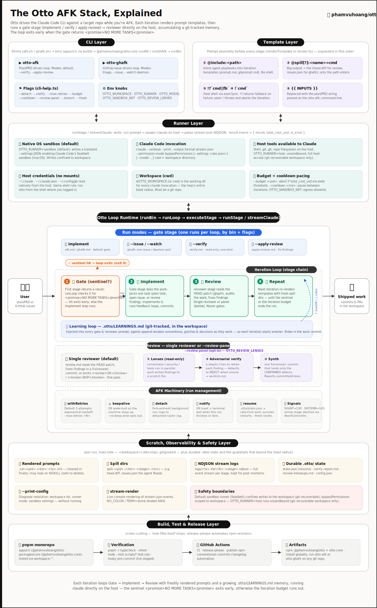

<h1 align="center">Otto</h1>

<p align="center">
  <strong>An autonomous agent harness for Claude Code — it ships while you're AFK.</strong><br>
  Hand Otto a plan, a PRD, or a backlog of GitHub/Linear issues — it implements, reviews, and commits, iteration after iteration, until the work is done.<br>
  Every run is sandboxed, budgeted, governed, and evaluable, and leaves a git-tracked evidence trail you can inspect, compare, and trust.
</p>

<p align="center">
  <a href="https://www.npmjs.com/package/@phamvuhoang/otto"></a>
  <a href="https://www.npmjs.com/package/@phamvuhoang/otto-core"></a>
  <a href="https://github.com/phamvuhoang/otto/actions/workflows/ci.yml"></a>
  <a href="./LICENSE"></a>
</p>

<p align="center">
  <a href="#quick-start">Quick start</a> ·
  <a href="#why-otto">Why Otto</a> ·
  <a href="#use-cases">Use cases</a> ·
  <a href="#how-it-works">How it works</a> ·
  <a href="#documentation">Docs</a>
</p>

---

Otto drives the [Claude Code](https://docs.anthropic.com/claude/docs/claude-code) CLI (or [Codex](https://github.com/openai/codex) via `--agent codex`) against a target repository in an iterating **implement → review** pipeline, running the agent directly on the host. It remembers what it learns, thinks before it codes, reviews its own work on a budget, and survives rate limits and restarts. Docker is not required.

**Built as a real agent harness, not a `while`-loop:** native-OS sandboxing, per-run cost budgets, a git-tracked **evidence bundle** per run, a CI-runnable **eval/benchmark** harness, governed memory, a repo-local **safety policy** with prompt-injection taint-fencing, adaptive compute routing (review depth **and** per-stage model tier, `--model-routing`), worktree-isolated **sub-agent fan-out** of independent plan tasks (`--fan-out`), reusable **skills**, and an opt-in, secrecy-filtered **public journal** (build-in-public to Threads, off by default) — all driven from the CLI and importable as a library ([`@phamvuhoang/otto-core`](./packages/core)).

> ⚠️ **Security:** Otto runs Claude with `--permission-mode bypassPermissions`. The default `OTTO_RUNNER=sandbox` uses Claude Code's native OS sandbox (Seatbelt on macOS) to confine writes to the workspace; `OTTO_RUNNER=host` runs unsandboxed. Point it only at repositories, plans, and issues you trust — see **[SECURITY.md](./SECURITY.md)**.

<p align="center">
  
</p>

---

## Quick start

```bash
# 1. Authenticate Claude Code on the host (one-off)
claude /login

# 2. Install the CLI globally
npm i -g @phamvuhoang/otto

# 3. From any git repo, hand Otto a plan + PRD and let it run
otto-afk "./docs/plans/feature.md ./docs/prd/feature.md" 10
```

That's it. Otto renders its prompt, implements one task, reviews the diff, commits, and repeats — up to 10 iterations or until it emits `<promise>NO MORE TASKS</promise>`. Want the unattended overnight version?

```bash
otto-afk --detach --notify "./docs/plans/feature.md" 50   # fork to background, toast when done
```

New to it? The **[QUICKSTART](./QUICKSTART.md)** walks zero-to-first-loop. No GitHub needed for `otto-afk`; `otto-ghafk` adds a one-time `gh auth login`.

---

## Setting up on a new machine

Everything you need to go from a fresh PC to an autonomous agent watching your GitHub backlog.

### 1. Install prerequisites

```bash
node --version   # must be 20+; install via https://nodejs.org or nvm

# GitHub CLI (needed for otto-ghafk)
brew install gh       # macOS
# Windows/Linux: https://cli.github.com

# Claude Code CLI
npm i -g @anthropic-ai/claude-code
```

### 2. Authenticate

```bash
claude /login   # opens a browser — one-time per machine
gh auth login   # choose: GitHub.com → HTTPS → Login with browser
```

### 3. Install Otto

```bash
npm i -g @phamvuhoang/otto

otto-afk --version   # verify
```

### 4. Set your model (optional but recommended)

Add to `~/.zshrc` or `~/.bashrc` so every session picks it up:

```bash
# Option A — pin one model everywhere
export OTTO_MODEL=claude-sonnet-4-6

# Option B — let Otto pick the cheapest tier per stage (recommended)
export OTTO_MODEL_ROUTING=1
export OTTO_TIER_CHEAP=claude-haiku-4-5-20251001
export OTTO_TIER_MID=claude-sonnet-4-6
export OTTO_TIER_STRONG=claude-opus-4-8
```

### 5. Label issues for Otto

In your GitHub repo, create a label called **`otto`** (this is the default — Otto will only pick up issues carrying this label):

```bash
gh label create otto --color 0075ca --description "Picked up by Otto" --repo owner/name
```

To use a different label name, set `OTTO_WATCH_LABEL`:

```bash
export OTTO_WATCH_LABEL=ai-task   # Otto will watch for this label instead
```

### 6. Confirm everything resolves

```bash
cd ~/code/my-project
otto-ghafk --print-config   # shows resolved model, runner, workspace, label — no charge
```

### 7. Start the watch daemon

Otto polls for open issues with the `otto` label, picks one up, runs the full **brainstorm → spec → plan → TDD implement → review → fix → PR** pipeline, then idles until the next one arrives.

**Foreground — see every step live:**

```bash
otto-ghafk \
  --watch \
  --watch-interval 300 \   # poll every 5 minutes
  --review-panel \         # correctness + security + tests lenses + adversarial verify
  --model-routing \        # cheapest model per stage, escalates on failure
  --budget 20 \            # $20 hard ceiling for the whole session
  --notify \               # OS toast when a run finishes or wedges
  20                       # max 20 iterations per issue
```

**Background / fully AFK:**

```bash
otto-ghafk \
  --watch --watch-interval 300 \
  --detach --notify \
  --review-panel --model-routing \
  --budget 20 \
  20

otto-tail          # attach at any time to see the live status tree
otto-runs list     # list all runs — status, cost, iterations, elapsed
otto-inspect latest   # "what happened and why did Otto stop?"
```

**Scope to a specific repo:**

```bash
otto-ghafk --repo owner/name --watch --watch-interval 300 --detach --notify 20
# or: export OTTO_GITHUB_REPOS=owner/name
```

### 8. Speed up large issues with sub-agent fan-out (otto-afk only)

When running `otto-afk` against a plan file (not in watch mode), Otto can split independent tasks into **parallel worktree sub-agents** and merge their commits back serially. Any conflict or failure falls back to the normal sequential loop — no half-merged state.

```bash
# First, let Otto author the plan and task graph — no source edits, then exit
otto-afk --plan "./docs/ideas/my-feature.md"

# Then fan the independent tasks out to parallel sub-agents
otto-afk --plan --fan-out "./docs/ideas/my-feature.md" 20

# Control how many sub-agents run concurrently (default: 3)
otto-afk --fan-out --fan-out-concurrency 4 "./docs/plans/feature.md" 20
```

> **Note:** `--fan-out` is not available in `--watch` mode. For issue-driven watch runs (`otto-ghafk --watch`), Otto works sequentially per issue. Fan-out applies when you drive `otto-afk` directly against a plan file.
>
> **`--plan` + `--fan-out` together:** when a previously authored task graph already exists and fan-out lands implementation work, that run is treated as an _implement_ — Otto reviews the aggregated fan-out diff and finalizes, rather than re-authoring the next plan over the slice docs. If fan-out lands nothing, the run authors a plan as usual.

---

## Setting up Linear watch

Shorter than GitHub — you just need a Linear personal API key instead of `gh`.

### 1. Connect Linear

```bash
otto-linear-auth login   # paste your Linear personal API key when prompted
                         # key lives at: linear.app → Settings → API → Personal API keys
```

### 2. Label issues for Otto

Create a label called **`otto`** in your Linear workspace (Settings → Labels). Assign it to any issue you want Otto to pick up.

To use a different label:

```bash
export OTTO_LINEAR_LABEL=ai-task   # overrides the default "otto"
```

### 3. Start the watch daemon

```bash
otto-linear-afk \
  --watch --watch-interval 300 \
  --detach --notify \
  --review-panel --model-routing \
  --budget 20 \
  20

# Optional: scope to a team or project
otto-linear-afk --watch --watch-interval 300 20                       # all teams
otto-linear-afk --project "Roadmap Q3" --watch --watch-interval 300 20   # one project
```

Everything else is identical to the GitHub workflow — `otto-tail`, `otto-runs list`, `otto-inspect latest` all work the same way.

---

## Why Otto

A naïve harness just loops `claude` until the iteration count runs out. Otto is the loop **plus the harness around it** — the parts that make an unattended run safe, affordable, and trustworthy:

| Concern         | A bare `while` loop around `claude` | **Otto**                                                                            |
| --------------- | ----------------------------------- | ----------------------------------------------------------------------------------- |
| When to stop    | a fixed count, or never             | senses completion (`NO MORE TASKS`); early-stops on stalled progress                |
| Rate limits     | the loop dies                       | waits out the reset and resumes the same iteration; optional provider auto-switch   |
| Crash / restart | redoes everything                   | resumes from `.otto/state.json`; never redoes committed work                        |
| Code review     | none                                | self-review + an adversarial lens panel; only confirmed fixes land                  |
| Cost            | blind                               | per-run `--budget` ceiling, pacing, and token accounting                            |
| Memory          | none                                | git-tracked, governed learnings injected into every prompt                          |
| Safety          | full blast radius                   | native-OS sandbox + repo-local `.otto/policy.json` + prompt-injection taint-fencing |
| Observability   | terminal scrollback                 | an evidence bundle per run you can `inspect`, `compare`, and benchmark              |
| Compute spend   | same review depth always            | adaptive routing by change risk                                                     |
| Model spend     | top model for every stage           | cheapest sufficient model tier per stage; escalate on repeated failure              |
| Parallelism     | one growing context, serial         | independent plan tasks fan out to isolated worktree sub-agents, then merge          |
| Reuse           | copy-pasted prompts                 | validated, retrievable skills                                                       |
| Sharing         | learnings stay in the repo          | opt-in, secrecy-filtered public journal (zero-leak gate)                            |

The rest of this section is the detail behind each row:

- 🧠 **It remembers.** Otto keeps a git-tracked `.otto/LEARNINGS.md` in your repo and injects it into every prompt. As it works it appends durable, reusable knowledge — conventions, gotchas, decisions _and their why_, dead ends — so each iteration starts smarter. The file rides in the work commit; delete it to reset Otto's memory.
- 📐 **It thinks before it codes.** Every iteration runs an adaptive **brainstorm → spec → plan → TDD** workflow. Hand it a crisp plan and it implements directly; hand it a vague one and it plays both sides of a brainstorm — generating clarifying questions, answering each with the most reasonable repo-grounded default, recording assumptions to `.otto/specs/`, then implementing test-first. Autonomously: it records its reasoning and proceeds rather than stopping to ask.
- 🔎 **It reviews itself, on a budget.** Past the single reviewer, an opt-in **review panel** runs read-only `correctness` / `security` / `tests` lenses, then an adversarial verifier that tries to _refute_ each finding (rejecting when unsure) before a single `fix(review):` commit lands only the confirmed defects. Cap spend with `--budget`, pace with `--cooldown`.
- 🎚️ **It can spend compute by risk.** Opt-in `--adaptive-router` routes each iteration's review depth by the risk of its change — single reviewer for a docs tweak, a lens subset for a narrow code change, the full panel for a security-sensitive or cross-module one — and stops a run early once it stops producing a meaningful diff. Off by default; pure, deterministic routing.
- 📊 **It can show token usage.** `--token-mode measure` prints per-stage and run-total input/output/cache token counts from Claude's `result` event. `--token-mode reduce` also applies conservative render-time prompt compaction; default `off` preserves current output and prompts.
- 🔁 **It survives the night.** Holds an OS wake-lock, retries transient failures with backoff, waits out Claude rate limits and resumes the same iteration, and persists `.otto/state.json` so a restart picks up where it left off — never redoing committed work.
- 🧾 **It leaves a paper trail.** Every run writes a durable **evidence bundle** to `.otto/runs/<run-id>/` — a manifest (inputs, runtime, iteration count, token/cost totals, exit reason, next action) plus one record per stage. `otto-inspect [latest]` renders it into a compact "what happened and why did Otto stop?" report, so you review the outcome instead of replaying `.otto-tmp/logs`.
- 🗃️ **Its memory is governed, not a growing blob.** Underneath the flat `LEARNINGS.md`, Otto can keep structured memory records as one git-tracked JSON file each under `.otto/memory/<id>.json` — every record carrying provenance (source run, task key), scope (which files/modules it applies to), confidence, trust level, and a freshness policy (expiry / revalidate). Newer records supersede older ones. `otto-memory audit` reports stale, conflicting, and frequently-used entries _before_ they influence a run, and `otto-memory project` renders only the **active** records back into a bounded `LEARNINGS.md` — so prompt size from memory stays explainable instead of contaminating unrelated runs with stale assumptions.
- 🛡️ **It governs what an unattended run may do.** A git-tracked `.otto/policy.json` declares repo-local safety rules — blocked commands, allowed write roots / network domains, secret patterns, high-risk globs, approval-required actions. Otto evaluates every host-shell / `@spill` command against the deny-list at the render boundary: a blocked command is _skipped_ — never executed — and recorded as a `blocked` safety event in the run's evidence bundle. Untrusted inputs it ingests (issue bodies, comments, external review docs) are fenced in a labelled `<untrusted>` block carrying a do-not-obey warning, so prompt-injection text can't pose as instructions. **The default empty policy restricts nothing**, so trusted local workflows are unchanged — a repo opts into governance by populating the file.
- 🛠️ **It gives you an operator view.** A CLI-first cockpit over the evidence bundles: `otto-runs list` for a one-row-per-run summary (status, iterations, cost, elapsed), `otto-inspect [latest]` for one run's report, `otto-explain [latest]` to re-render any run in plain language a non-engineer can verify, `otto-tail [latest]` to attach to a running loop and watch a live status tree (prints the done card once it finalizes), and `otto-eval compare <run-a> <run-b>` to A/B two past runs side-by-side **without re-paying for a run**. `--explain-routing` prints the adaptive router's per-iteration reasoning (change class, risk, chosen review depth) so a routing decision is never a black box. The in-run console is quiet by default (one terse line per meaningful action — edits, commits, test results, errors); `--verbose` restores the full firehose.
- 🧩 **It can turn repeated workflows into skills.** Stable, repeated procedures (release flow, test bootstrap, a migration pattern) can be promoted into git-tracked `.otto/skills/<name>/` packages — instructions + metadata + constraints + a last-validated run. `otto-skills candidates` suggests them from runs that succeeded the same way twice; `otto-skills why <changed-files>` shows which skills retrieval would pick and **why** (by capability, touched files, and change risk). A skill must be **validated before it is eligible**, and stale skills are flagged rather than reapplied.
- 🧮 **It can spend the cheapest model that does the job.** Opt-in `--model-routing` routes each stage to a model **tier** — `cheap` for docs/test-only changes, `mid` for ordinary code, `strong` for design/review/security — and **escalates a tier on repeated failure**, so a wedged run climbs to a stronger model on its own. A pinned `--model`/`OTTO_MODEL` always wins and disables routing. Pure, deterministic tier selection; the ladder (`haiku`/`sonnet`/`opus` by default) is overridable per tier.
- 🗜️ **It can compress token-heavy context — reversibly.** Opt-in `--context-compressor headroom` routes large `@spill` content (issue bodies, comments, diffs) through a local [Headroom](https://github.com/headroomlabs-ai/headroom) binary before the agent reads it, cutting input tokens on long runs. It **never hides evidence**: every compression retains the original under the run bundle (`.otto/runs/<id>/compressed/`) and records tokens before/after, savings, and latency as a tool-usage record surfaced in `--context-report`. The compressor runs under repo-local **tool authority** (P19) — declared in `.otto/tools/`, scoped by `.otto/policy.json`, never inherited from personal config. Off by default; a missing/failed `headroom` **degrades cleanly** to today's behavior with a clear warning, not a broken run.
- 🪢 **It can parallelize independent work.** When a plan ships a machine-readable task graph (`.otto/tasks/<key>/tasks.json`, authored by `--plan`), opt-in `--fan-out` runs the independent tasks as **isolated git-worktree sub-agents** (each with its own bounded context), then cherry-picks their commits back onto the workspace — **serially, with a hard fallback**: any merge conflict or sub-agent failure defers that task to the normal sequential loop, so fan-out never leaves the tree half-merged. Worst case it degrades to today's behavior.
- 📣 **It can build in public — safely.** Opt-in per repo, at the end of a run Otto can turn one generic craft learning into a short "field note" and publish it to **Threads** ("a coding agent's field notes"). Every candidate passes an **airtight, default-deny secrecy gate** — a deterministic deny-list (secrets, tokens, paths, code, URLs, the repo's own names, plus your `.otto/policy.json` secret patterns), a generalization check, and an adversarial LLM judge biased to refuse — and **a post that cannot be proven safe is never sent** (zero-leak is the hard gate). The sandboxed agent only ever produces text; the harness owns the gate and the network. **Draft-only by default** (screened notes land in `.otto/journal/drafts/`); actually posting needs an explicit **double opt-in**.

Beyond the build loop, two read/repair modes reuse all of the above:

- 🔍 **`--verify`** — a read-only pass that reconciles a plan against git, runs the suites, and writes a DONE/GAP/DEFERRED report. Changes nothing.
- 🩹 **`--apply-review <doc>`** — consumes an external code-review document and fixes its actionable findings one per iteration, tracking deferred ones in the task-local `.otto/tasks/<task-key>/followups.md`.

---

## Use cases

The trailing number on the loop bins is the **max iteration count**; a run also stops early when the agent emits `<promise>NO MORE TASKS</promise>`.

### Real-world scenarios

Start here — concrete end-to-end jobs people actually run. Each maps to the feature recipes below.

| You want to…                                                                 | Run this                                                                                                                                                        |
| ---------------------------------------------------------------------------- | --------------------------------------------------------------------------------------------------------------------------------------------------------------- |
| **Clear my GitHub backlog overnight, cheaply, with merge-confident reviews** | `otto-ghafk --detach --notify --model-routing --review-panel 30`                                                                                                |
| **Turn a rough idea into a spec, then a reviewed, tested feature**           | `otto-afk --plan "./docs/ideas/x.md"` → review the plan → `otto-afk --review-panel "./docs/ideas/x.md ./.otto/tasks/x/plan.md" 20`                              |
| **Ship one specific issue (and its sub-issues) and stop**                    | `otto-ghafk --issue 42 --include-sub-issues 20`                                                                                                                 |
| **Land a big feature faster by parallelizing independent tasks**             | `otto-afk --plan --fan-out "./docs/ideas/x.md" 20`                                                                                                              |
| **Bring in the Superpowers TDD skill and have Otto actually use it**         | `otto-skills sources add sp ./vendor/superpowers --type local && otto-skills sync && otto-skills validate tdd` → `otto-afk --use-skills "./docs/plans/x.md" 10` |
| **Hand an unattended run to a non-engineer to accept or reject**             | run any loop, then `otto-explain latest`                                                                                                                        |
| **Audit what actually landed without changing anything**                     | `otto-afk --verify "./docs/plans/x.md ./docs/prd/x.md"`                                                                                                         |
| **Fix the findings of an external code review, one at a time**               | `otto-afk --apply-review ./code-review.md 20`                                                                                                                   |
| **Keep a repo's backlog moving on its own**                                  | `otto-ghafk --watch --watch-interval 300 5`                                                                                                                     |
| **Run the whole thing on Codex instead of Claude**                           | `otto-afk --agent codex "./docs/plans/x.md" 10`                                                                                                                 |

The recipes below are grouped by capability — reach for them to compose your own scenario.

### 1. Ship work autonomously

```bash
# Implement a plan + PRD, up to 10 iterations
otto-afk "./docs/plans/feature.md ./docs/prd/feature.md" 10

# Overnight, unattended: fork to background, hold a wake-lock, toast on finish/wedge
otto-afk --detach --notify "./docs/plans/inventory.md ./docs/prd/inventory.md" 50

# Burn down a GitHub backlog — one issue per iteration
otto-ghafk 10
otto-ghafk --issue 42 5                         # just issue #42, then stop
otto-ghafk --issue 42 --include-sub-issues 20   # an epic and its sub-issues

# Burn down a Linear backlog (label `otto`); --issue ENG-123 scopes to one
otto-linear-auth login                          # paste a Linear API key, once
otto-linear-afk 10

# Plan first: author a world-class spec + test-first plan (+ a machine-readable
# task graph) under .otto/tasks/ for human review — makes NO source edits, then exits
otto-afk --plan "./docs/ideas/inventory-revamp.md"

# Then fan the plan's INDEPENDENT tasks out to isolated worktree sub-agents
# (parallel), before the normal sequential loop finishes + reviews
otto-afk --plan --fan-out "./docs/ideas/inventory-revamp.md" 20
otto-afk --fan-out --fan-out-concurrency 4 "./docs/plans/feature.md" 20
```

### 2. Operate & inspect the harness

```bash
# List recent runs at a glance: status, iterations, cost, elapsed (newest first)
otto-runs list

# Render one run's evidence bundle — "what happened and why did Otto stop?"
otto-inspect latest
otto-inspect 2026-06-20T05-53-11-000Z-12345     # a specific run id

# Re-render any past run in plain language for a non-engineer to verify
otto-explain latest
otto-explain 2026-06-20T05-53-11-000Z-12345     # a specific run id

# Attach to a running loop — polls the evidence bundle and prints a live tree;
# switches to the done card once the run finalizes (note: otto-watch is the
# separate ghafk/linear daemon that polls for labelled issues)
otto-tail                                        # attach to the latest run
otto-tail 2026-06-20T05-53-11-000Z-12345        # attach to a specific run id

# A/B two recorded runs side-by-side — FREE, no model call
otto-eval compare latest 2026-06-19T22-10-00-000Z-9876

# See exactly what will resolve (config + preflight) before any paid run
otto-afk --print-config

# Console output: by default Otto prints one terse line per meaningful action
# (file edits, git commits, test results, errors). Use --verbose to restore the
# full in-run firehose from all agent events.
otto-afk --verbose "my plan" 10
```

### 3. Evaluate & benchmark harness quality

```bash
# Replay the eval fixtures across configs and score each run (paid; never CI)
otto-eval benchmarks/suite.json benchmarks/configs.json --iterations 3

# Compare two past runs' trajectories — succeeded / cost / tokens / elapsed /
# safety events / skills used — without re-running anything
otto-eval compare <run-a> <run-b>

# Measure real token usage (in/out/cache, per stage + run total) without changing prompts
otto-afk --token-mode measure "./docs/plans/feature.md" 5

# See what filled the context window each stage + the per-iteration token slope
# of the latest run (playbook / learnings / diffs / reads) — read-only, then exit
otto-afk --context-report

# Score the authored plans (.otto/tasks/*/spec.md + plan.md) against the plan
# rubric — presence (scope guard? per-task verify? file map?) AND P13 depth (real
# paths? named failing test? testable success criteria?) — read-only
otto-afk --plan-report
```

### 4. Control cost & compute

```bash
# Hard spend cap (halts at the ceiling) + pacing between iterations
otto-afk --budget 5 --cooldown 2000 "./docs/plans/spike.md" 20

# Higher-confidence review: correctness/security/tests/structural lenses, severity-ranked
# → adversarial verify → one consolidated fix(review): commit of only the confirmed defects
otto-afk --review-panel "./docs/plans/feature.md" 30

# Spend review compute by risk: single reviewer for docs, full panel for security —
# and print WHY each iteration routed the way it did
otto-afk --adaptive-router --explain-routing "./docs/plans/feature.md" 10

# Spend the cheapest model per stage: cheap for docs/tests, strong for review —
# escalating a tier on repeated failure. --explain-routing prints each decision.
otto-afk --model-routing --explain-routing "./docs/plans/feature.md" 10

# Override the tier ladder (default haiku/sonnet/opus) for this run
OTTO_TIER_STRONG=claude-opus-4-8 otto-afk --model-routing "./docs/plans/feature.md" 10

# A pinned model always wins and disables tier routing (every stage uses the pin)
OTTO_MODEL=claude-opus-4-8 otto-afk --model-routing "./docs/plans/feature.md" 10

# Conservative render-time prompt compaction + token reporting
otto-afk --token-mode reduce "./docs/plans/feature.md" 5

# Compress token-heavy spilled content (issue bodies, comments, diffs) through a
# local Headroom binary — reversible: originals are retained under the run bundle
# and the savings show up in --context-report. Off by default; degrades cleanly
# (a clear warning, no broken run) if `headroom` is not installed.
otto-afk --context-compressor headroom "./docs/plans/feature.md" 10
# or set it per-shell / per-repo:
OTTO_CONTEXT_COMPRESSOR=headroom otto-afk "./docs/plans/feature.md" 10
# .otto/config.json: { "contextCompressor": "headroom" }
# Put the compressor under repo-local tool authority (P19): otto-tools list/why/health
```

### 5. Govern memory, safety & skills

```bash
# Governed memory: audit stale / conflicting / frequently-used records before they
# influence a run, then project the ACTIVE ones back into a bounded LEARNINGS.md
otto-memory audit
otto-memory project > .otto/LEARNINGS.md

# Safety policy: a repo opts into governance by populating .otto/policy.json
# (blocked commands, allowed write roots / network domains, secret patterns…).
# Blocked host commands are skipped and recorded as a safety event in the bundle.

# Skills: promote repeated successful workflows into validated, reusable procedures
otto-skills candidates                          # workflows that succeeded the same way >= 2x
otto-skills why packages/core/src/eval.ts       # which skills retrieval would pick, and why
otto-skills list                                # inventory + validated/unvalidated/stale status

# Skills: import external skill packs (Superpowers, PM-Skills) as pinned, inert sources (P16)
otto-skills sources add sp ./vendor/superpowers --type local   # register a source (git|local|archive)
otto-skills sync --dry-run                       # deterministic preview: add/update/unchanged/conflict
otto-skills sync                                 # import as trust=unverified skills + write skills.lock.json
otto-skills audit --external                     # unpinned refs, missing licenses, dup names, stale copies
# Imported skills are inert: unverified + unvalidated, so the loop never auto-applies them.

# Skills: prove an imported skill is safe, compatible, and useful before it can shape a run (P17)
otto-skills validate tdd                         # static lint + risk scan + compatibility class + drills
otto-skills validate prd --source pm-skills      # assert provenance against a named source
# Classes: afk-safe | interactive-only | stage-scoped | blocked. Persisted to skill.json, not auto-applied.

# Skills: actually inject validated skills into live stages, bounded + attributed + recorded (P18)
otto-skills why --stage reviewer --changed src/api.ts   # which validated skills route to a stage, and why
otto-afk --use-skills "./docs/plans/feature.md" 10      # opt in (or OTTO_USE_SKILLS=1 / config "skills.enabled")
# Off by default. skillsUsed[] lands in the evidence bundle (otto-inspect / otto-explain / otto-eval).

# Tools: register external tools/MCP/services under repo-local, policy-scoped authority (P19)
otto-tools list                                 # registered .otto/tools/<name>.json adapters
otto-tools why review                           # which tools the review stage may use, and why
otto-tools audit                                # unreachable, missing health check, policy conflicts
otto-tools health                               # run each tool's health-check command
# Authority = intersection of the tool's declared scope and .otto/policy.json; personal
# MCP/plugin config is never inherited into a run. No .otto/tools/ ⇒ unchanged behavior.

# Extensions: start from a curated profile instead of raw source/tool config (P21)
otto-extensions list                            # coding-superpowers | pm-planning | context-saver | security-review
otto-extensions init context-saver --dry-run    # preview every file it would write
otto-extensions init context-saver              # writes normal, diffable .otto/ config — git diff to review
# Profiles are generated config, not hidden behavior; sources stay unverified until you validate.
# See docs/EXTENSIONS.md for the compatibility matrix + update/lock/rollback.
```

**Bringing in a specific pack?** [**docs/INTEGRATIONS.md**](./docs/INTEGRATIONS.md) is a from-scratch, step-by-step guide for [Superpowers](https://github.com/obra/superpowers) (coding), [Product-Manager-Skills](https://github.com/deanpeters/Product-Manager-Skills) (planning), a single [Cursor review skill](https://github.com/cursor/plugins/blob/main/cursor-team-kit/skills/thermo-nuclear-code-quality-review/SKILL.md), and [Headroom](https://github.com/headroomlabs-ai/headroom) (context compression) — clone → register → validate → activate, with the gotchas (capability tagging, interactive-skill flagging, local-vs-git sync) called out.

### 6. Verify & repair (read-only / surgical)

```bash
# Did the plan actually land? Read-only DONE/GAP/DEFERRED report; changes nothing
otto-afk --verify "./docs/plans/feature.md ./docs/prd/feature.md"

# Consume an external code review and fix its actionable findings, one per iteration
otto-afk --apply-review ./code-review.md 20
```

### 7. Multi-provider, scope & daemon

```bash
# Run with Codex instead of Claude (after `codex login` / CODEX_API_KEY / OPENAI_API_KEY)
otto-afk --agent codex --print-config
OTTO_AGENT=codex otto-ghafk 5

# Start on Claude, auto-switch to Codex on a rate limit instead of waiting
otto-afk --fallback-agent codex --auto-switch-on-limit "./docs/plans/feature.md" 20

# Drive a different repo and pin the model
OTTO_WORKSPACE=~/code/other-repo OTTO_MODEL=claude-opus-4-8 otto-afk "./docs/plans/feature.md" 10

# Daemon: poll for newly-labelled issues and pick them up as they arrive
otto-ghafk --watch --watch-interval 300 5
otto-ghafk --repo owner/name --watch 5          # scope the daemon to one repo
```

### 8. Build in public (Threads — opt-in, off by default)

At the end of a run Otto can publish a generic, secrecy-screened "field note" to Threads. It is **a complete no-op unless you opt in**, and **draft-only until you double opt-in** to posting.

```bash
# 1. Opt the repo in — .otto/config.json (draft-only: writes screened notes to disk)
cat > .otto/config.json <<'JSON'
{ "journal": { "enabled": true, "autonomous": false,
               "categories": ["gotcha", "dead-end"], "minDaysBetweenPosts": 1 } }
JSON

# Now every run drafts at most one screened note to .otto/journal/drafts/<id>.md
# (gate decisions are logged to .otto/journal/audit.log). Otto never posts yet.
otto-afk "./docs/plans/feature.md" 10

# 2. To let Otto actually POST, give it Threads credentials...
export OTTO_THREADS_TOKEN=<long-lived-threads-token>
export OTTO_THREADS_USER_ID=<threads-user-id>
#    ...or ~/.config/otto/threads.json: { "token": "...", "userId": "..." }

# 3. ...flip autonomous in config AND set the env flag (the double opt-in):
#    "journal": { "enabled": true, "autonomous": true, ... }
OTTO_JOURNAL_AUTONOMOUS=1 otto-afk "./docs/plans/feature.md" 10
```

Even autonomous, a note ships only if it clears every gate (deny-list → generalization → adversarial judge); anything ambiguous is denied and drafted instead of posted. Cadence (`minDaysBetweenPosts`) and de-duplication (`.otto/journal/posted.json`) cap it to at most one post per run.

### 9. Phase 3 — deeper plans, sharper reviews, clearer reports (P13 / P14 / P15)

These raise the _substance_ of what Otto checks. No new flags for the common path: the plan gate runs in `--plan` mode, the report is emitted every run, and the structural review rides on `--review-panel`.

**Deeper plans (P13).** In `--plan` mode Otto scores the plan's _depth_, not just whether the sections exist — does the file map list real paths, does each task name a failing test and a verify command, are the success criteria testable. A thin plan is re-planned once with the shortfall fed back; if it's still thin, Otto pauses rather than build on a weak spec. In an interactive terminal it shows the rubric and asks you to approve / edit / reject before any code is written (AFK runs auto-approve and record the assumption). Use it when a weak plan is the cheapest place to prevent rework.

```bash
otto-afk --plan "./docs/ideas/inventory-revamp.md"   # author + gate the plan
otto-afk --plan-report                               # score existing plans, read-only
```

**Sharper, cheaper reviews (P14).** `--review-panel` gains a `structural` lens that asks "did this change make the codebase worse?" (incidental complexity, file bloat, spaghetti, missed simplifications). Every finding is severity-ranked (`blocker | major | minor | nit`), nits are suppressed when real issues exist, and only confirmed fixes land in one `fix(review):` commit. Add `--adaptive-router` to spend review compute by risk (single reviewer for docs; the full panel — structural + security — only for risky changes) and `--model-routing` to put the strong model only where it pays. Use it for merge confidence and codebase health, not just "it works."

```bash
otto-afk --review-panel "./docs/plans/feature.md" 30
otto-afk --review-panel --adaptive-router --model-routing --explain-routing "./docs/plans/feature.md" 30
```

**Clearer reports (P15).** Every run ends with an outcome-first report that leads with _what you can now do_ (not just what changed), auto-cites its evidence (HEAD, changed files, review severities), and is held to a legibility rubric — a low-scoring report is rewritten once before handoff. Plan/AFK runs that used to emit nothing now always leave a readable report; if an agent emits none, Otto synthesizes an honest fallback from the run's own evidence. Use it to hand unattended work to a non-engineer to accept or reject.

```bash
otto-explain latest                                  # render the report for a non-engineer
```

Full flag reference and more recipes: **[docs/CLI.md](./docs/CLI.md)**.

---

## How it works

Otto ships as two npm packages:

- **[`@phamvuhoang/otto`](./apps/cli)** — the CLI: `otto-afk` (plan/PRD loop), `otto-ghafk` (GitHub-issue loop), and `otto-linear-afk` (Linear-issue loop, with the `otto-linear` helper + `otto-linear-auth` credential tool). The read-only operator bins: `otto-inspect` renders one run's evidence bundle, `otto-explain` re-renders any run in plain language for a non-engineer, `otto-runs` lists recent runs, `otto-tail` attaches to a running loop for a live status tree, `otto-eval compare` A/Bs two of them (and `otto-eval` benchmarks harness quality across configs — the [eval suite](./benchmarks)), `otto-memory` audits the governed memory records, `otto-skills` inventories and validates repo-local skill packages, `otto-tools` inspects the repo-local external-tool authority registry, and `otto-extensions` enables curated extension profiles.
- **[`@phamvuhoang/otto-core`](./packages/core)** — the library: iteration loop, native-sandbox runner, template renderer, stage registry. Importable from any Node project.

Each iteration runs a **stage chain**: a **gate** stage (implement / verify / apply-review, depending on the bin and flags) followed by a **reviewer**. Before each stage, Otto renders a prompt template — expanding `@include`, `@spill`, `` !?`cmd` ``, `` !`cmd` ``, and `{{ INPUTS }}` tags — and injects the workspace's `.otto/LEARNINGS.md`. If the gate emits the sentinel `<promise>NO MORE TASKS</promise>`, the loop exits before the reviewer runs.

The [architecture diagram](#otto) above maps the full stack: CLI + template layers → native-sandbox runner → the loop runtime (run modes, learning loop, review panel) → scratch/observability/safety → build & release. The runtime internals are documented in **[docs/ARCHITECTURE.md](./docs/ARCHITECTURE.md)**.

---

## Configuration

Otto is configured by flags and environment variables. The essentials:

| Variable                  | Default         | Purpose                                                                                 |
| ------------------------- | --------------- | --------------------------------------------------------------------------------------- |
| `OTTO_WORKSPACE`          | `cwd`           | Host repo the selected agent runs against; also where `.otto-tmp/` is written.          |
| `OTTO_RUNNER`             | `sandbox`       | `sandbox` confines writes to the workspace; `host` runs the selected agent unsandboxed. |
| `OTTO_MODEL`              | _(CLI default)_ | Pin the active runtime's model (`--model` pass-through).                                |
| `OTTO_TOKEN_MODE`         | `off`           | `off`, `measure`, or `reduce`; overridden by `--token-mode`.                            |
| `OTTO_CONTEXT_COMPRESSOR` | `off`           | `off` or `headroom`; overridden by `--context-compressor`. Compresses `@spill` content. |

### How to set config values

Every value resolves in a fixed precedence order — **CLI flag → environment variable → `.otto/config.json` → built-in default** — so a flag always wins for a single run, an env var sets a per-shell default, and the config file persists a choice for a repo. Pick the mechanism by how long the choice should stick:

```bash
# 1. Per-run — a flag, highest precedence, affects only this invocation
otto-afk --token-mode measure --budget 5 "<plan-and-prd>" 20

# 2. Per-shell — an env var, applies to every Otto run in this shell
export OTTO_RUNNER=host
export OTTO_MODEL=claude-opus-4-8
otto-afk "<plan-and-prd>" 20

# 2b. One-off env override, scoped to a single command
OTTO_TOKEN_MODE=reduce otto-afk "<plan-and-prd>" 20

# 3. Persistent — add the export lines to ~/.zshrc / ~/.bashrc for every new shell
```

Branch settings (`branchStrategy`, `branchPrefix`, `branchConvention`) can also be **persisted per-repo** in `<workspace>/.otto/config.json`. Running `otto-afk` in a TTY offers to write this file for you ("Remember for this repo?"); flags and env still override it.

Always confirm what actually resolved before a paid run:

```bash
otto-afk --print-config     # resolved config + a preflight check of run prerequisites, then exit
```

### What you can set

**Flags** (per-run; same set across all bins unless noted):

- **Agent runtime** — `--agent <claude|codex>` (default `claude`), `--fallback-agent <claude|codex>`, `--auto-switch-on-limit`
- **Loop & cost** — `--budget <usd>`, `--cooldown <ms>`, `--max-retries <N>`, `--max-wait <dur>`, `--token-mode <off|measure|reduce>`, `--context-compressor <off|headroom>`, `--review-panel`, `--adaptive-router`, `--model-routing`, `--fresh`
- **Orchestration** (`otto-afk`) — `--model-routing` (per-stage model tier by difficulty/risk), `--fan-out` + `--fan-out-concurrency <n>` (parallel worktree sub-agents from a plan task graph)
- **Process & UX** — `--detach`, `--log <path>`, `--notify`, `--no-keep-alive`, `--explain-routing`, `--verbose`, `--print-config`, `--context-report`, `--plan-report`, `--help`, `--version`
- **Branch** — `--branch <current|branch|worktree>`, `--branch-convention <c>`, `--branch-prefix <p>`
- **Targeting** (`otto-ghafk` / `otto-linear-afk`) — `--watch`, `--watch-interval <sec>`, `--repo <owner/name>`, `--project <name>`, `--issue <ref>`, `--include-sub-issues` (otto-ghafk; with `--issue`)
- **Modes** (`otto-afk`) — `--plan` (author spec + plan, no edits), `--verify` (read-only reconcile), `--apply-review <doc>`

**Environment variables** (per-shell defaults): `OTTO_WORKSPACE`, `OTTO_RUNNER`, `OTTO_SANDBOX_NET`, `OTTO_RESULT_GRACE_MS`, `OTTO_AGENT`, `OTTO_FALLBACK_AGENT`, `OTTO_AUTO_SWITCH_ON_LIMIT`, `OTTO_MODEL`, `OTTO_CLAUDE_MODEL`, `OTTO_CODEX_MODEL`, `OTTO_TOKEN_MODE`, `OTTO_CONTEXT_COMPRESSOR`, `OTTO_HEADROOM_BIN`, `OTTO_REVIEW_LENSES`, `OTTO_ADAPTIVE_ROUTER`, `OTTO_EXPLAIN_ROUTING`, `OTTO_MAX_WAIT`, `OTTO_WATCH_LABEL`, `OTTO_GITHUB_REPO(S)`, `OTTO_INCLUDE_SUB_ISSUES`, `OTTO_BRANCH`, `OTTO_BRANCH_PREFIX`, `OTTO_BRANCH_CONVENTION`, `OTTO_LINEAR_API_KEY` / `LINEAR_API_KEY`, `OTTO_LINEAR_LABEL`, `OTTO_LINEAR_TEAM`, `OTTO_LINEAR_PROJECT(S)`, `OTTO_LINEAR_DONE_STATE`, and `NO_COLOR` / `TERM=dumb`.

Phase-2 orchestration & journal (all opt-in, off by default):

- **Model routing (P11)** — `OTTO_MODEL_ROUTING` (truthy = on; same as `--model-routing`), `OTTO_TIER_CHEAP` / `OTTO_TIER_MID` / `OTTO_TIER_STRONG` (override the tier→model ladder; default `haiku` / `sonnet` / `opus`).
- **Sub-agent fan-out (P11)** — `OTTO_FAN_OUT` (truthy = on; same as `--fan-out`).
- **Public journal (P12)** — opt in per repo via `.otto/config.json` `{ "journal": { "enabled": true, "autonomous": false, "categories": ["gotcha","dead-end"], "minDaysBetweenPosts": 1 } }`. Posting requires a **double opt-in**: `journal.autonomous: true` **and** `OTTO_JOURNAL_AUTONOMOUS=1`. Threads credentials come from `OTTO_THREADS_TOKEN` + `OTTO_THREADS_USER_ID` (or `~/.config/otto/threads.json`). Drafts/audit/ledger live under `.otto/journal/` (git-ignored).

Full per-value descriptions, defaults, and runner/sandbox/branch details live in **[docs/CONFIG.md](./docs/CONFIG.md)**; every flag and mode is documented in **[docs/CLI.md](./docs/CLI.md)**.

---

## Installation

```bash
npm i -g @phamvuhoang/otto              # global — run otto-afk / otto-ghafk from anywhere
npm i -D @phamvuhoang/otto              # per-repo — ./node_modules/.bin/otto-afk
npx -y @phamvuhoang/otto otto-afk …     # no install — bootstrap on demand
```

Requires **Node 20+** and an authenticated agent runtime: **Claude Code** (`claude /login`) by default, or **Codex CLI** (`codex login`, `CODEX_API_KEY`, or `OPENAI_API_KEY`) when selected with `--agent codex`. `otto-ghafk` also needs authenticated **`gh`**; `otto-linear-afk` needs a Linear personal API key via `otto-linear-auth login`. See [docs/CONFIG.md → Prerequisites](./docs/CONFIG.md#prerequisites).

---

## Documentation

| Doc                                                                    | What's in it                                                                                                                           |
| ---------------------------------------------------------------------- | -------------------------------------------------------------------------------------------------------------------------------------- |
| **[QUICKSTART.md](./QUICKSTART.md)**                                   | Zero-to-first-loop getting started.                                                                                                    |
| **[docs/CLI.md](./docs/CLI.md)**                                       | Every command, flag, and mode — start at [Choosing a mode](./docs/CLI.md#choosing-a-mode) (afk vs ghafk vs verify vs apply-review).    |
| **[docs/CONFIG.md](./docs/CONFIG.md)**                                 | Environment variables, runner/sandbox, branch strategy, setup.                                                                         |
| **[docs/ARCHITECTURE.md](./docs/ARCHITECTURE.md)**                     | Runtime internals and data flow for library extenders.                                                                                 |
| **[docs/EXTENSIONS.md](./docs/EXTENSIONS.md)**                         | Curated extension profiles: what each writes, the compatibility matrix, and update/lock/rollback.                                      |
| **[docs/INTEGRATIONS.md](./docs/INTEGRATIONS.md)**                     | From-scratch, step-by-step recipes for Superpowers, Product-Manager-Skills, a single Cursor skill, and Headroom.                       |
| **[docs/MIGRATION.md](./docs/MIGRATION.md)**                           | Task-grouped `.otto/tasks/<task-key>/` layout, old→new path mapping, branch-convention namespace, and how to migrate an existing repo. |
| **[docs/quality-report-samples.md](./docs/quality-report-samples.md)** | Filled-in sample quality reports — what good verification output looks like per run mode.                                              |
| **[SECURITY.md](./SECURITY.md)**                                       | Threat model and the `bypassPermissions` blast-radius story.                                                                           |
| **[CONTRIBUTING.md](./CONTRIBUTING.md)**                               | Dev loop, tests, adding a stage, release pipeline.                                                                                     |
| **[RELEASING.md](./RELEASING.md)**                                     | release-please flow, version policy, secrets, rollback.                                                                                |

---

## Contributing

Otto is a pnpm monorepo. The dev loop:

```bash
pnpm install
pnpm -r build        # compile packages/core/dist (only core builds)
pnpm -r typecheck
pnpm -r test         # core: vitest
pnpm test            # root: node --test over scripts/*.test.mjs
```

A husky pre-commit hook runs `lint-staged` (prettier) + typecheck. Releases are automated via [release-please](./RELEASING.md) — never hand-edit version fields. Full contributor guide in **[CONTRIBUTING.md](./CONTRIBUTING.md)**.

---

## License

[MIT](./LICENSE) © Henry Pham.
